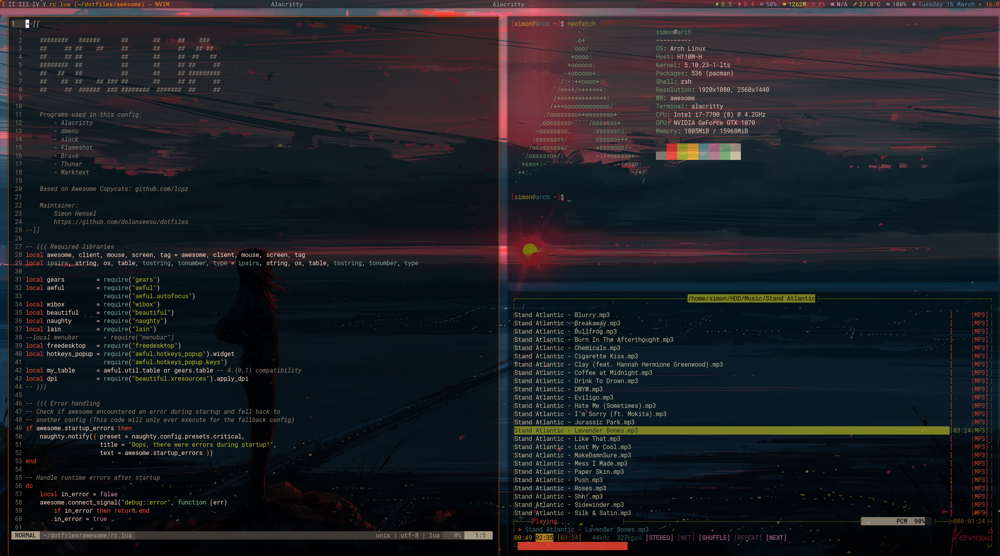

# Dotfiles



This repository contains my personal Linux dotfiles.

The Awesome theme is a based on [Awesome Copycats](https://github.com/lcpz/awesome-copycats).

## Installation

Clone the repo into your home directory:

```bash
git clone https://github.com/dolanseesu/dotfiles.git ~/ && cd dotfiles
```

Run the install-script. You may ignore the question about the laptop setup, that is just for my personal setup.
WARNING: This script deletes all presets files and replaces them with symlinks, so use with caution.

While this repo was created for personal use, feel free to use it (the terms of the GNU General Public License v3.0 apply).
Please note that these files are often a work in progress, so I won't make any guarantees that these will work for you. Also I'm not responsible if they break your system.
